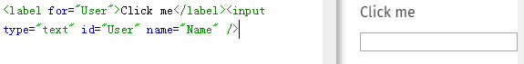
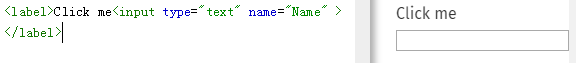

这次我就来介绍一下 HTML 的常用标签如:
< a >;
< form >;
< h1 > ~ < h6 >;
< iframe >;
< input >;
< selet >;
< textarea >;
< table >。

**#< a >**

< a >：anchor ,可以创建通向其他网页、文件、同一页面内的位置、电子邮件地址或任何其他 URL 的超链接，即定义超链接。

属性

download

此属性指示浏览器下载 URL 而不是导航到它，因此将提示用户将其保存为本地文件。

href

包含超链接指向的 URL 或 URL 片段。一般基于 Web（HTTP）的文档时域名会加上 http：或 https：，当然也可以使用浏览器支持的任何协议。例如，在大多数浏览器中正常工作的file:、ftp:和mailto：。（// 即代表无协议）。
当 href="#" 时，页面并不会发请求，而是会返回到页面顶部。
当 href="javascript:;" 时，这是一个伪装协议，伪协议可以实现「点击之后没有任何动作的 a 标签」。

target

该属性指定在何处显示链接的资源。 取值为标签（tab），窗口（window），或框架（iframe）等浏览上下文的名称或其他关键词。
当 target="_blank"时，会打开新页面；
当 target="_self"时，会在当前页面加载；
当 target="_parent"时，会在当前父级页面加载页面；
当 target="_top"时，会在当前顶级页面加载页面。

**#< form >**

< from >：表示了文档中的一个区域，这个区域包含有交互控制元件，用来向web服务器提交信息。

属性

action
一个处理这个form信息的程序所在的URL。这个值可以被 < button > 或者 < input > 元素中的 formaction 属性重载（覆盖）。当< form >标签里面没有提交按钮是，不能将信息提交。< input >标签里当其 type=submit,时是唯一能确定该表单能被提交。
若用< button >标签标示提交按钮时，而且若表单里只有一个按钮时，且没有定义该< button >属性时，该< button >标签会自动升级为提交按钮；若该< button >标签被 type 属性定义时，则不会自动升级为提交按钮。

**#< h1 > ~ < h6 >**

< h1 >-< h6 >：heading，呈现了六个不同的级别的标题，< h1 > 级别最高，而 < h6 > 级别最低。
使用时注意，
不要为了减小标题的字体而使用低级别的标题；
避免跳过某级标题：始终要从 <h1> 开始，接下来依次使用 <h2> 等等；
使用 <section> 元素时，为了方便起见，你应该考虑避免在同一个页面上重复使用 <h1>，<h1> 应被用于表示页面的标题，其他的标题当从 <h2> 开始。在使用 section 时，应当为每个 section 都使用一个 <h2>。

**#< iframe >**

< iframe >：Inline frame，内联框架表示嵌套的浏览上下文，有效地将另一个HTML页面嵌入到当前页面中。

属性

frameborder

取值为1时，告诉浏览器在当前iframe与其他iframe之间绘制边框，取0时则无需绘制此边框。

name

嵌入的浏览上下文（框架）的名称。该名称可以用作< a >标签，< form >标签的target属性值，或< input > 标签和 < button >标签的formtaget属性值。

src

嵌套页面的URL地址。使用遵守同源策略的 'about:blank' 来嵌套空白页。

**#< input >**

< input >：用于为基于Web的表单创建交互式控件，以便接受来自用户的数据; 可以使用各种类型的输入数据和控件小部件，具体取决于设备和user agent。是空元素。
< input >的工作方式因其类型属性的值而有很大差异，不同的类型会在各自的参考页中进行介绍。如果未指定此属性，则采用的默认类型为 text 。

< input >的类型

button

无缺省行为按钮。

checkbook

复选框必须使用 value 属性定义此控件被提交时的值。

password

一个值被遮盖的单行文本字段。使用 maxlength 指定可以输入的值的最大长度 。

radio

单选按钮。必须使用 value 属性定义此控件被提交时的值。在同一个“单选按钮组”中，所有单选按钮的 name 属性使用同一个值； 一个单选按钮组中是，同一时间只有一个单选按钮可以被选择。

submit

用于提交表单的按钮。

text

单行字段；换行会将自动从输入的值中移除。

使用 label  "for" 属性 绑定到 input "id"属性上时，可以用< label >标签将< input >标签包起来来代替，这样可以减少变量的输入。如：

**#< selet >**

< selet >：表示一个控件，提供一个选项菜单，菜单内的选项为< option >。

属性

disabled

这个属性表明一个用户是否可以操控该表单对象。 如果这个属性被定义时，则对应选项不可选。

multiple

这个属性标记select是否可以多选. 默认是单选。

**#< textarea >**

< textarea >：一个多行纯文本编辑控件。

属性

cols

文本域的可视宽度，必须为正数。

name

元素的名称。

rows

元素的输入文本的行数（显示的高度）。
使用 row 和 cols 不能精确控制文本域的宽高，最好使用 CSS控制文本域的宽高。

**#< table >**

< table >：表示表格数据 — 即通过二维数据表表示的信息。该元素中只能允许有以下元素：
一个可选的 <caption> 元素
零个或多个的 <colgroup> 元素
一个可选的 <thead> 元素
一个可选的 <tfoot> 元素（< tfoot >元素出现在< tbody >或< tr >元素前后都可以。）
零个或多个 <tbody> 元素
一个或多个 <tr> 元素
在有 <thead> 元素下< tfoot >元素出现在< tbody >或< tr >元素前后都可以，浏览器会自动排序。
在< tr >元素里，表头要用< th >，数据用< td >。

属性

bgcolor 

这个属性定义了表格的背景颜色。 

border 

这个整型元素使用像素，定义了表格边框的大小。如果设置为0，这意味着frame 属性被设置为空。如果设置为1，表示表格具有1px大小的边框。