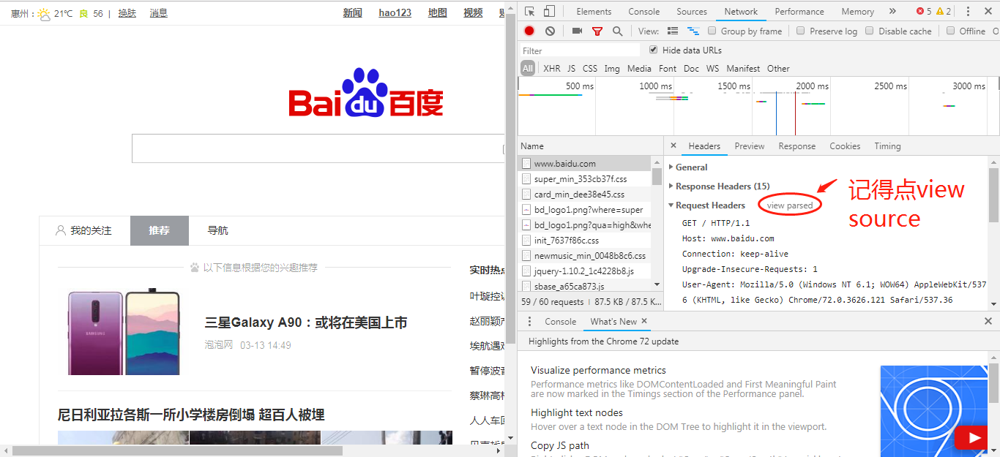
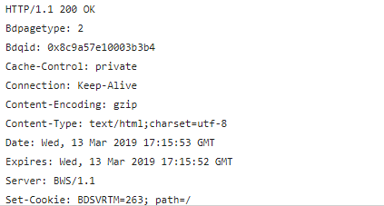
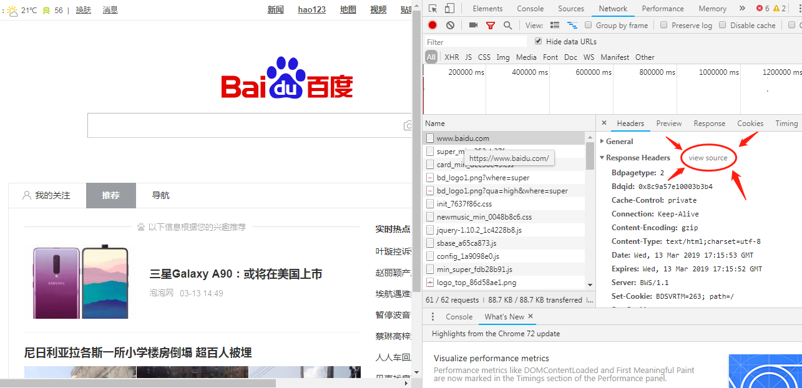

HTTP(HyperText Transfer Protocol,超文本传输协议)是一种用于分布式、协作试和超媒体信息系统的应用层协议，可以看作是是从服务器传输数据到客户端的传输协议。HTTP是万维网的数据通信的基础。

**#客户端和服务器端交互的过程**
1.浏览器负责发起请求
2.服务器在 80 端口接收请求
3.服务器负责返回内容（响应）
4.浏览器负责下载响应内容

**#请求消息结构**

请求示例

curl -X POST -d "12345678" -s -v -H "Mrlee: HELLO" -- "https://www.baidu.com"

请求的内容为

POST / HTTP/1.1
Host: www.baidu.com
User-Agent: curl/7.55.0
Accept: */*
Mrlee: HELLO
Content-Length: 8
Content-Type: application/x-www-form-urlencoded

1234567890

**请求的格式**

1 动词 路径 协议/版本
2 Key1: value1
2 Key2: value2
2 Key3: value3
2 Content-Type: application/x-www-form-urlencoded
2 Host: www.baidu.com
2 User-Agent: curl/7.54.0
3 
4 要上传的数据

请求最多包含四部分，最少包含三部分。（也就是说第四部分可以为空）。
第三部分永远都是一个回车（\n）。
动词有 GET POST PUT PATCH DELETE HEAD OPTIONS 等。
这里的路径包括「查询参数」，但不包括「锚点」。
如果你没有写路径，那么路径默认为 /。
第 2 部分中的 Content-Type 标注了第 4 部分的格式。

**用Chrome看请求内容**

1.打开 Network，
2.地址栏输入网址，
3.在 Network 点击，查看 Request Headers，
4.点击「view source」，
5.就可以看到请求的前三部分了，
6.如果有请求的第四部分，那么在 FormData 或 Payload 里面可以看到。

**#响应结构**

请求了之后，应该都能得到一个响应。

响应示例

刷新百度首页得到的响应。

响应的内容是

HTTP/1.1 200 OK
Bdpagetype: 2
Bdqid: 0x8c9a57e10003b3b4
Cache-Control: private
Connection: Keep-Alive
Content-Encoding: gzip
Content-Type: text/html;charset=utf-8
......
以下省略

**响应的格式**

1 协议/版本号 状态码 状态解释
2 Key1: value1
2 Key2: value2
2 Content-Length: 17931
2 Content-Type: text/html
3
4 要下载的内容

其中状态码是服务器对浏览器说的话
1xx消息，这一类型的状态码，代表请求已被接受，需要继续处理。
2xx成功，这一类型的状态码，代表请求已成功被服务器接收、理解、并接受。
3xx重定向，这类状态码代表需要客户端采取进一步的操作才能完成请求。
4xx客户端错误，由于明显的客户端错误（例如，格式错误的请求语法，太大的大小，无效的请求消息或欺骗性路由请求），服务器不能或不会处理该请求。
5xx服务器错误，表示服务器无法完成明显有效的请求。
第 2 部分中的 Content-Type 标注了第 4 部分的格式。
第 2 部分中的 Content-Type 遵循 MIME 规范。

**用 Chrome 查看响应**

1.打开 Network，
2.输入网址，
3.选中第一个响应，
4.查看 Response Headers，
5.点击「view source」，
6.你会看到响应的前两部分，
7.查看 Response 或者 Preview，你会看到响应的第 4 部分。

**#curl 命令的使用**

curl是一个利用URL规则在命令行下工作的文件传输工具，可以说是一款很强大的http命令行工具。它支持文件的上传和下载，是综合传输工具，但按传统，习惯称url为下载工具。

语法：# curl [option] [url]
常见参数：
-A/--user-agent <string>              设置用户代理发送给服务器
-b/--cookie <name=string/file>    cookie字符串或文件读取位置
-c/--cookie-jar <file>                    操作结束后把cookie写入到这个文件中
-C/--continue-at <offset>            断点续转
-D/--dump-header <file>            把header信息写入到该文件中
-e/--referer                                  来源网址
-f/--fail                                          连接失败时不显示http错误
-o/--output                                  把输出写到该文件中
-O/--remote-name                      把输出写到该文件中，保留远程文件的文件名
-r/--range <range>                      检索来自HTTP/1.1或FTP服务器字节范围
-s/--silent                            静音模式。不输出任何东西
如：
curl -s -v -H "mrlee: hello" -- "https://www.baidu.com"

请求的内容为

GET / HTTP/1.1
Host: www.baidu.com
User-Agent: curl/7.54.0
Accept: */*
mrlee: hello

curl -X POST -d "12345678" -s -v -H "mrlee: hello" -- "https://www.baidu.com"
请求的内容为

POST / HTTP/1.1
Host: www.baidu.com
User-Agent: curl/7.54.0
Accept: */*
mrlee: hello
Content-Length: 8
Content-Type: application/x-www-form-urlencoded

12345678